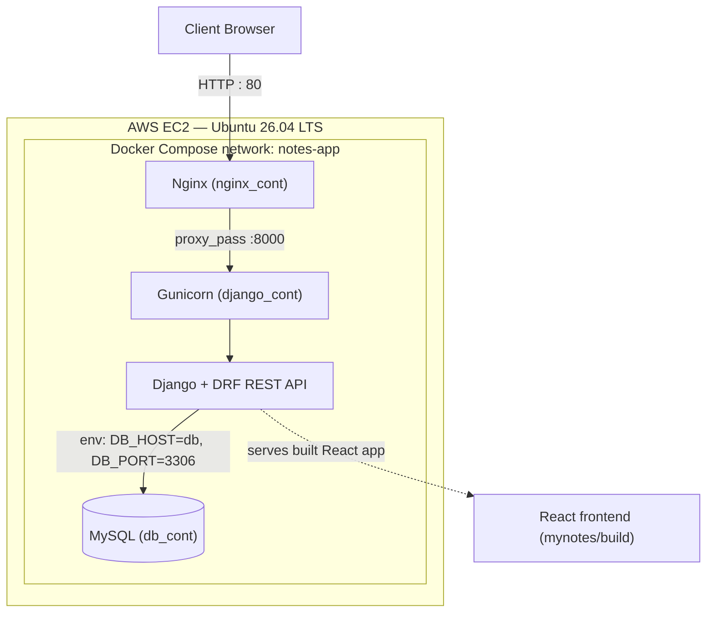

# 📝 Dockerized Django Notes App — Deployed on AWS EC2


A multi-container Notes application (Django REST API + React frontend + MySQL) containerized with **Docker Compose** and deployed on an **AWS EC2 Ubuntu instance**, fronted by an **Nginx** reverse proxy in front of **Gunicorn**.

This project was built to practice and demonstrate real-world Docker/DevOps skills: multi-service orchestration, container networking, health checks, persistent volumes, and cloud deployment — not just running `docker run` on a single container.

---

## 📐 Architecture



**Request flow:** browser hits the EC2 public IP on port 80 → Nginx receives it and proxies to the Django container's Gunicorn process on port 8000 → Django (with Django REST Framework) serves the API under `/api/` and the built React app for every other route → Django talks to MySQL using the Compose service name `db` as the hostname (not a hardcoded IP or container name).

---

## 🧰 Tech Stack

| Layer | Technology |
|---|---|
| Frontend | React (pre-built static bundle served by Django) |
| Backend | Django 4.1, Django REST Framework |
| WSGI Server | Gunicorn |
| Reverse Proxy | Nginx (Alpine) |
| Database | MySQL |
| Containerization | Docker, Docker Compose |
| Hosting | AWS EC2 (Ubuntu 26.04 LTS) |

---

## 📁 Project Structure

```
.
├── api/                 # Django app — Notes REST API (CRUD)
├── mynotes/             # React frontend source + pre-built static bundle
├── notesapp/            # Django project (settings, urls, wsgi)
├── nginx/
│   ├── Dockerfile        # nginx:1.23-alpine + custom config
│   └── default.conf      # Reverse proxy config → django_cont:8000
├── staticfiles/         # Collected Django static assets
├── Dockerfile           # Django app image (python:3.9 + mysqlclient + gunicorn)
├── docker-compose.yml   # 3-service orchestration: nginx, django, db
├── requirements.txt
├── .env.example         # Template for required environment variables
└── README.md
```

---

## 🐳 Docker Compose Services

| Service | Container | Image / Build | Ports | Depends On | Health Check |
|---|---|---|---|---|---|
| `nginx` | `nginx_cont` | build: `./nginx` (nginx:1.23-alpine) | `80:80` | `django` | — |
| `django` | `django_cont` | build: `.` (python:3.9) | `8000:8000` | `db` | `curl http://localhost:8000/admin` |
| `db` | `db_cont` | `mysql` | `3306:3306` | — | `mysqladmin ping` |

The Django container's actual startup command (set in `docker-compose.yml`, overriding the Dockerfile's default dev-server `CMD`) is:

```bash
sh -c "python manage.py migrate --no-input && gunicorn notesapp.wsgi --bind 0.0.0.0:8000"
```

This runs database migrations automatically on every container start, then hands off to Gunicorn instead of Django's built-in dev server — closer to how this would run in production.

MySQL data persists across container restarts/recreations via a named volume (`mysql-data:/var/lib/mysql`), and all three services share a custom bridge network (`notes-app`) so containers can reach each other by **service name** rather than IP.

---

## 🔑 Environment Variables

Django reads its database connection details from environment variables (`notesapp/settings.py`). Create a `.env` file in the project root (never commit this — it's already in `.gitignore`):

**.env.example**
```env
DB_NAME=test_db
DB_USER=root
DB_PASSWORD=root
DB_HOST=db
DB_PORT=3306
```

> **Known limitation:** the `db` service in `docker-compose.yml` currently has `MYSQL_ROOT_PASSWORD` and `MYSQL_DATABASE` hardcoded directly rather than pulled from `.env`. A cleaner setup would template both the `db` and `django` service credentials from the same `.env` file so there's a single source of truth. Listed under **Future Improvements** below.

---

## 🚀 Getting Started

**1. Clone the repository**
```bash
git clone git@github.com:amanmaner011/Docker-Project---Django-Notes-App.git
cd Docker-Project---Django-Notes-App
```

**2. Create your environment file**
```bash
cp .env.example .env
# edit .env if you want different DB credentials
```

**3. Build and start all services**
```bash
docker compose up -d --build
```

**4. Verify everything is healthy**
```bash
docker compose ps
```
Expected output once containers settle:
```
NAME           IMAGE                       STATUS         PORTS
db_cont        mysql                       Up (healthy)   3306->3306
django_cont    docker-project...-django    Up (healthy)   8000->8000
nginx_cont     docker-project...-nginx     Up             80->80
```

**5. Open the app**
- Via Nginx (production path): `http://<server-ip>/`
- Direct to Django (bypassing Nginx, useful for debugging): `http://<server-ip>:8000/`

---

## 🛠️ Useful Docker Commands

```bash
# View logs for a specific service
docker compose logs -f django

# Open a shell inside a running container
docker compose exec django bash

# Restart just one service after a code change
docker compose restart django

# Tear down containers but keep volumes (data persists)
docker compose down

# Tear down containers AND remove volumes (full reset, wipes DB data)
docker compose down -v

# Reclaim disk space after repeated builds
docker system prune -a
docker builder prune
docker image prune -a
df -h   # confirm space was actually freed
```

---

## ☁️ Deployment Details (AWS EC2)

- **Instance:** AWS EC2, Ubuntu 26.04 LTS
- **Security Group:** inbound rules for `22` (SSH) and `80` (HTTP) — port 80 had to be added explicitly; it isn't open by default
- **Runtime:** Docker + Docker Compose v2 installed on the instance
- **Source control:** repository pulled to the instance over SSH (deploy key configured on the EC2 instance, not a personal token), so `git pull` / `git push` work directly from the server
- **Process:** `docker compose up -d --build` run directly on the EC2 instance; Nginx is the only service exposed to the public internet via the security group

---

## 🐛 Problems Solved During Deployment

These were the real issues hit while getting this running on EC2 — left here because they're exactly the kind of thing that comes up in DevOps interviews.

**1. Site unreachable after deployment**
Only port 22 was open on the EC2 security group. Docker Compose was running fine on the instance, but nothing outside it could reach port 80. Fixed by adding an inbound rule for HTTP (80).

**2. `depends_on` not enforcing the right startup order**
Compose's `depends_on` must reference the **service name** defined in `docker-compose.yml` (e.g. `db`), not the `container_name` (`db_cont`). Using the container name there silently breaks dependency resolution.

**3. MySQL data disappearing on container recreation**
No `volumes` section meant every `docker compose down` / rebuild wiped the database. Fixed by mounting a named volume at `/var/lib/mysql` so data survives container lifecycle changes.

**4. Health check being silently ignored**
A typo (`healtcheck` instead of `healthcheck`) meant Compose just ignored the block entirely — no error, the health check simply never registered. Caught this by inspecting `docker compose config` output, which expands and validates the full resolved file.

**5. Docker build failing with no disk space left**
`docker build` failed with `no space left on device` in `/var/cache/apt/archives/`. Root cause was accumulated dangling images and build cache from repeated rebuilds. Fixed with `docker system prune -a`, `docker builder prune`, and `docker image prune -a`, then verified with `df -h`.

---

## 🎯 What This Project Demonstrates

- Writing and reasoning about a multi-service `docker-compose.yml` (not just a single `Dockerfile`)
- Container networking — service discovery by name, custom bridge networks, why container name ≠ service name
- Data persistence with named volumes
- Health checks and service dependency ordering (`depends_on` + `healthcheck`)
- Reverse proxying a containerized app with Nginx
- Debugging container startup failures systematically (logs → config validation → root cause, not guesswork)
- Basic cloud networking on AWS (security groups, exposing the right ports)
- Disk/image hygiene on a long-running Docker host

---

## 🔭 Future Improvements

- Move MySQL root credentials and `DB_NAME` into `.env` instead of hardcoding them in `docker-compose.yml`
- Move Django `SECRET_KEY` and `DEBUG` into environment variables; set `DEBUG=False` for production
- Remove the direct `8000:8000` port mapping on the `django` service now that Nginx handles public traffic — only Nginx needs to be exposed
- Add HTTPS via Let's Encrypt / Certbot in the Nginx container
- Add a GitHub Actions workflow to build and push the image automatically on push (the repo's `Jenkinsfile`/`Procfile` are leftovers from the original template and aren't part of this deployment)
- Automate MySQL volume backups

---

## 🙏 Acknowledgments

The base Notes application (React frontend + Django REST API) originates from the open-source [django-notes-app](https://github.com/LondheShubham153/django-notes-app) built for the TrainWithShubham (TWS) community. This repository's focus — and the work documented here — is the **containerization, multi-service Docker Compose orchestration, Nginx/Gunicorn setup, and AWS EC2 deployment** built on top of it.

---

## 👤 Author

**Aman Maner**
📧 amanmaner011@gmail.com
🔗 [GitHub](https://github.com/amanmaner011) · [LinkedIn](https://linkedin.com/in/aman-maner)
